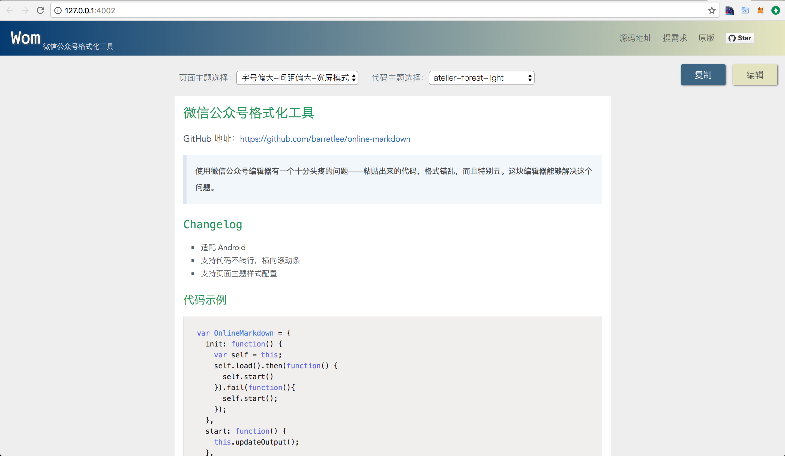

# Wom

> wom: an offline markdown dditor for Wechat MP



## Install

```
$ npm i -g wom
```

## Usages

```
$ wom
```

open with default browser with http://127.0.0.1:4002/

## Contributing

1. Fork it
2. Create your feature branch (`git checkout -b my-new-feature`)
3. Commit your changes (`git commit -am 'Add some feature'`)
4. Push to the branch (`git push origin my-new-feature`)
5. Create new Pull Request

## 版本历史

- v1.0.0 初始化版本

## 欢迎fork和反馈

- write by `i5ting` i5ting@126.com

如有建议或意见，请在issue提问或邮件

## License

MIT. Thanks for @Phodal.
MIT. Thanks for @barretlee.

this repo is released under the [MIT
License](http://www.opensource.org/licenses/MIT).
